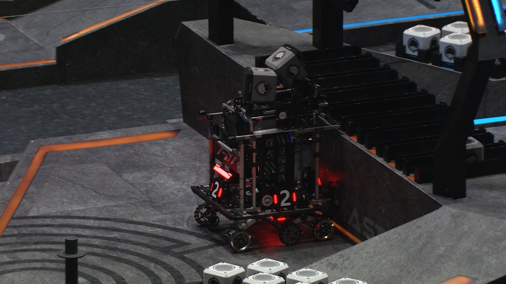
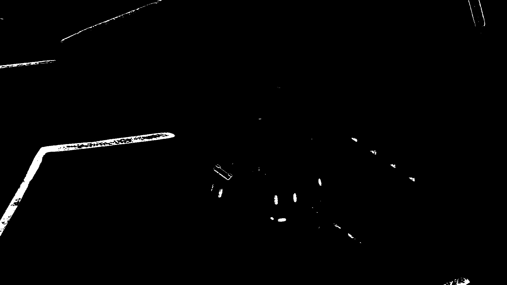
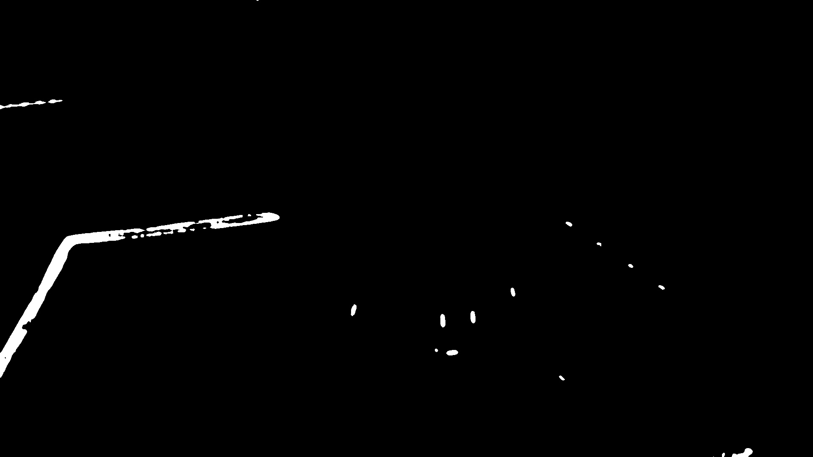
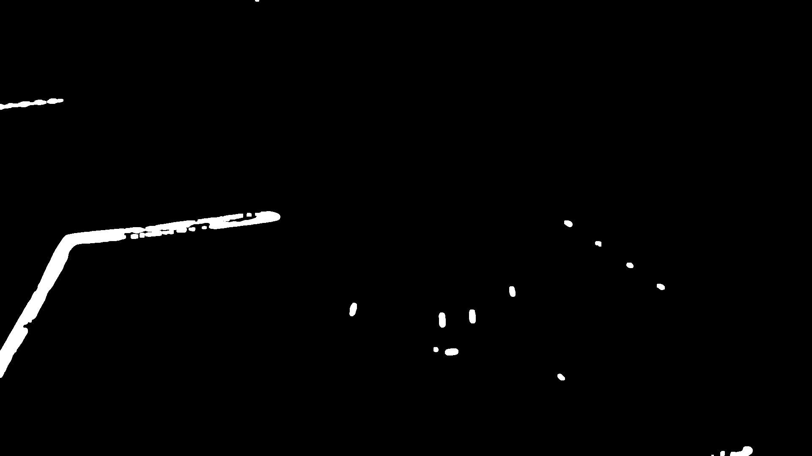

# Robomaster Armor Plate Detection Algorithm

## Version 1

Author: Ziyi (Kyrie) Xu

Organization: MAC Robomaster - CV Team

[TOC]

## 1 Introduction

In Robomaster Robotics Competition, auto-detection is an essential and powerful skill for allies detect enemies' robots and recognize types of robots, which can largely reduce the reaction time for players to control allies robots to aim the enemies, and also boost the precision of target aiming.

In this document, it is only my general purpose and perspectives about the detection. Because this is my first time to encounter the image processing , there exist a bunch of bugs that need to be tested, and there must be more simple ways or tricky ways to achieve the function. If you have any better idea, please let me know and try to do it. I just hope this document and codes can help you somehow, and provide several useful functions. I will put all references I researched at the end of the document. Hope this document can give you some ideas.

## 2 Scope

- The algorithm can detect the color around the armor plate (i.e. blue or red)
- The algorithm can detect the number on the armor plate, and use the detected number to distinguish different genes of robots
- The algorithm can read data from videos or real-time camera (TODO)
- Test the maximum distance that the algorithm can be used (TODO)

## 3 Idea

Here are my general ideas and purposes:

1. Determine a color list, in which the properties of fundamental colors (especially for red and blue) are contained.
2. Color Screen: Screen out areas that has the determined color
3. First Screen: Continue screening out areas that are the LED-bars around the armor plate, determined by the scale of width and length
4. Second Screen: Continue screening out pairs of LED-bars, determined by the spatial distance and parallel properties
5. Extract areas between the pairs of the LED-bars. The extracted areas contains the number of the armor plate
6. Use template matching to get the most possible digit on the armor plate
7. Draw the contours and mark the number and color

## 4 Algorithm

### 4.1 main module

This is our main loop function.

```python
import cv2
import argparse
import armor_detect as ad

# construct the argument parse and parse the arguments
ap = argparse.ArgumentParser()
ap.add_argument("-i", "--image",default='images/img3.jpg', help = "path to the image file")
ap.add_argument("-v","--video", help = "path to the video file")
args = vars(ap.parse_args())

if __name__ == '__main__':
    frame = cv2.imread(args["image"])
    (hsv,gray,binary) = ad.get_color(frame,1)
    ad.detect_armor_red_image(frame,gray,binary)
    (hsv,gray,binary) = ad.get_color(frame,2)
    ad.detect_armor_blue_image(frame,gray,binary)
```

Note: 

1. argparse is a third-party module that allows user to input arguments directly in terminal/shell.
   
   For example, in my python, we can directly type path, such as " -i images/img4.jpg" , to the end of the command. Then Python will run the codes with img4.jpg rather than the default one. 

```shell
$ c:/users/kyrie/appdata/local/programs/python/python37/python.exe c:/Users/kyrie/Desktop/RM_CV/main.py -i images/img4.jpg
```

2. We will use cv2 module, which contains most useful tools about image processing.

### 4.2 colorList module

This module stores all basic colors that needs to be detected.

```python
# From the source: https://blog.csdn.net/Int93/article/details/78954129

import numpy as np
import collections

# Define the upper bound and lower bound of colors
# --- USE HSV 
# eg：{color: [lower_bound, upper_bound]}
#{'red': [array([160,  43,  46]), array([179, 255, 255])]}

def getColorList():
    dict = collections.defaultdict(list)

    # black
    lower_black = np.array([0, 0, 0])
    upper_black = np.array([180, 255, 46])
    color_list = []
    color_list.append(lower_black)
    color_list.append(upper_black)
    dict['black'] = color_list

    # #gray
    # lower_gray = np.array([0, 0, 46])
    # upper_gray = np.array([180, 43, 220])
    # color_list = []
    # color_list.append(lower_gray)
    # color_list.append(upper_gray)
    # dict['gray']=color_list

    # white
    lower_white = np.array([0, 0, 221])
    upper_white = np.array([180, 30, 255])
    color_list = []
    color_list.append(lower_white)
    color_list.append(upper_white)
    dict['white'] = color_list

    # red
    lower_red = np.array([156, 43, 46])
    upper_red = np.array([180, 255, 255])
    color_list = []
    color_list.append(lower_red)
    color_list.append(upper_red)
    dict['red']=color_list

    # red2
    lower_red = np.array([0, 43, 46])
    upper_red = np.array([10, 255, 255])
    color_list = []
    color_list.append(lower_red)
    color_list.append(upper_red)
    dict['red2'] = color_list

    # red3（robomaster test）
    lower_red = np.array([0, 120, 130])
    upper_red = np.array([10, 255, 255])
    color_list = []
    color_list.append(lower_red)
    color_list.append(upper_red)
    dict['red3'] = color_list

    # orange
    lower_orange = np.array([11, 43, 46])
    upper_orange = np.array([25, 255, 255])
    color_list = []
    color_list.append(lower_orange)
    color_list.append(upper_orange)
    dict['orange'] = color_list

    # yellow
    lower_yellow = np.array([26, 43, 46])
    upper_yellow = np.array([34, 255, 255])
    color_list = []
    color_list.append(lower_yellow)
    color_list.append(upper_yellow)
    dict['yellow'] = color_list

    # green
    lower_green = np.array([35, 43, 46])
    upper_green = np.array([77, 255, 255])
    color_list = []
    color_list.append(lower_green)
    color_list.append(upper_green)
    dict['green'] = color_list

    # cyan
    lower_cyan = np.array([78, 43, 46])
    upper_cyan = np.array([99, 255, 255])
    color_list = []
    color_list.append(lower_cyan)
    color_list.append(upper_cyan)
    dict['cyan'] = color_list

    # blue
    lower_blue = np.array([100, 43, 46])
    upper_blue = np.array([124, 255, 255])
    color_list = []
    color_list.append(lower_blue)
    color_list.append(upper_blue)
    dict['blue'] = color_list

    # blue2 (robomaster test)
    lower_blue = np.array([100, 120, 130])
    upper_blue = np.array([124, 255, 255])
    color_list = []
    color_list.append(lower_blue)
    color_list.append(upper_blue)
    dict['blue2'] = color_list

    # purple
    lower_purple = np.array([125, 43, 46])
    upper_purple = np.array([155, 255, 255])
    color_list = []
    color_list.append(lower_purple)
    color_list.append(upper_purple)
    dict['purple'] = color_list

    return dict


if __name__ == '__main__':
    color_dict = getColorList()
    print(color_dict)

    num = len(color_dict)
    print('num=',num)

    for d in color_dict:
        print('key=',d)
        print('value=',color_dict[d][1])
```

Note:

1. In development, we only need to focus on the red3 and blue2, because they are tested for Robomaster competition.
2. 

```python
lower_red = np.array([0, 120, 130])
upper_red = np.array([10, 255, 255])
```

In the numpy array, [0,10,130] represents Hue, Saturation and Value (or intensity) of the color. These values can be changed after testing. 

Because the circumstance in competition field is dim, red or blue light can be easily seen.

### 4.3 myFunc module

This module is just to store and organize any useful functions 

```python
'''
    Here is to store any useful functions that might be used in image processing.
'''

import cv2

def cv_show(name,img):
   cv2.imshow(name, img)
   cv2.waitKey(0)
   cv2.destroyAllWindows()
```

Note:

1. cv_show() function is to quickly show the image.

### 4.4 armor_detect module

This module is to detect the LED-bars and find the area of armor plate.

The module use digit_recognize module (4.5) to detect the digit in the end.

```python
import cv2
import numpy as np
import argparse

import myFunc as mf
import colorList as cl

import digit_recognize as dr

# CONSTANTS
mask_size = 11
minArea = 30
minHWratio = 1
maxHWratio = 3
RED = 1
BLUE = 2

# LISTS
data_list_red = []  # 通过红色筛选后的轮廓 Color Screen - store contours 
                                        # with red3
first_data_red = [] # 第一次筛选后的轮廓    First Screen - store possible LED-bars
second_data1_red = []   # 第二次筛选后的灯柱1 Second Scrren - store pairs of     LED-bars - store the LED-bar 1
second_data2_red = []   # 第二次筛选后的灯柱2 Second Scrren - store pairs of     LED-bars - store the LED-bar 2

data_list_blue = [] # 第一次通过蓝色筛选后的轮廓 Color Screen - store contours 
                                        # with blue3
first_data_blue = []    # same as above
second_data1_blue = []
second_data2_blue = []
```

Here we use img3.jpg as an example.



------

get_color(frame,color=RED): 

parameters: 1) Frame: the input image 2) color: RED or BLUE

return: a tuple returns 1) hsv and 2) gray formats of the original image, and 3) the binary formats of the image after color screening.

------

##### Step 1

- At first, we need to detect the color (red color as an example) and use red_mask to detect all areas that have the preset color (red3). 
- But at the very beginning, we need to change the RGB image into HSV image, because the preset colors are determined by HSV formats.

```python
def get_color(frame,color=RED):
    if color == RED:
        print('go in get_red3')
        try:
            hsv = cv2.cvtColor(frame,cv2.COLOR_BGR2HSV)
            color_dict = cl.getColorList()
            mask = cv2.inRange(hsv,color_dict['red3'][0],color_dict['red3'][1])
            cv2.imwrite('red_mask.jpg',mask)
```



- In the above image, you can see, those white areas represent the detected red areas in the original image.

------

- Because the mask has many salt-and-pepper noise, we use median filter to reduce these noise
  
  ```python
  blurred = cv2.medianBlur(mask,mask_size)
  cv2.imwrite('red_blurred.jpg',blurred)
  ```
  
  

------

- Use dilate method to make contours more easily to be detected, and also use to link some segments.
  
  ```python
  binary = cv2.dilate(binary,None,iterations=2)
  cv2.imwrite("red_binary.jpg",binary)
  return (hsv,gray,binary)
  ```
  
  

------

detect_armor_red_image(frame,binary):            # used to detect the red armor plate (with digits recognition)

parameters: 1) frame: input image 2) binary: the color screen-out image (can be regarded as a mask)

return: none, it is a void function

##### Step 2

- At first, we need to use findContours() to help in extracting the contours from the image.
  
  > | void cv::findContours | (   | [InputArray](https://docs.opencv.org/master/dc/d84/group__core__basic.html#ga353a9de602fe76c709e12074a6f362ba)          | *image*,             |
  > | --------------------- | --- | ----------------------------------------------------------------------------------------------------------------------- | -------------------- |
  > |                       |     | [OutputArrayOfArrays](https://docs.opencv.org/master/dc/d84/group__core__basic.html#ga889a09549b98223016170d9b613715de) | *contours*,          |
  > |                       |     | [OutputArray](https://docs.opencv.org/master/dc/d84/group__core__basic.html#gaad17fda1d0f0d1ee069aebb1df2913c0)         | *hierarchy*,         |
  > |                       |     | int                                                                                                                     | *mode*,              |
  > |                       |     | int                                                                                                                     | *method*,            |
  > |                       |     | [Point](https://docs.opencv.org/master/dc/d84/group__core__basic.html#ga1e83eafb2d26b3c93f09e8338bcab192)               | *offset* = `Point()` |
  > |                       | )   |                                                                                                                         |                      |
  > 
  > | Python: |                  |                                                        |      |                     |
  > |:------- | ---------------- | ------------------------------------------------------ | ---- | ------------------- |
  > |         | cv.findContours( | image, mode, method[, contours[, hierarchy[, offset]]] | ) -> | contours, hierarchy |

```python
def detect_armor_red_image(frame,binary):
    if binary is not None:
        gray = cv2.cvtColor(frame,cv2.COLOR_BGR2GRAY)
        img1 = frame.copy() #备份1
        img2 = frame.copy()
        (cnts, hierachy) = cv2.findContours(binary.copy(),cv2.RETR_EXTERNAL,cv2.CHAIN_APPROX_SIMPLE)
        amount = len(cnts)
```

- cnts: returns a array that contains all contours that has red regions.

------

##### Step 3

- Next, I want to cnts array to get all information of each contour.

- use contourArea() to get the area of the contour
  
  > | double cv::contourArea | (   | [InputArray](https://docs.opencv.org/master/dc/d84/group__core__basic.html#ga353a9de602fe76c709e12074a6f362ba) | *contour*,           |
  > | ---------------------- | --- | -------------------------------------------------------------------------------------------------------------- | -------------------- |
  > |                        |     | bool                                                                                                           | *oriented* = `false` |
  > |                        | )   |                                                                                                                |                      |
  > 
  > | Python: |                 |                     |      |        |
  > |:------- | --------------- | ------------------- | ---- | ------ |
  > |         | cv.contourArea( | contour[, oriented] | ) -> | retval |

- minAreaRect() is to draw a rectangle that has the smallest area to encompass the contour
  
  > | [RotatedRect](https://docs.opencv.org/master/db/dd6/classcv_1_1RotatedRect.html) cv::minAreaRect | (   | [InputArray](https://docs.opencv.org/master/dc/d84/group__core__basic.html#ga353a9de602fe76c709e12074a6f362ba) | *points* | )   |     |
  > | ------------------------------------------------------------------------------------------------ | --- | -------------------------------------------------------------------------------------------------------------- | -------- | --- | --- |
  > |                                                                                                  |     |                                                                                                                |          |     |     |
  > 
  > | Python: |                 |        |      |        |
  > |:------- | --------------- | ------ | ---- | ------ |
  > |         | cv.minAreaRect( | points | ) -> | retval |
  > 
  > ```
  > #include <opencv2/imgproc.hpp>
  > ```
  > 
  > Finds a rotated rectangle of the minimum area enclosing the input 2D point set.
  > 
  > The function calculates and returns the minimum-area bounding rectangle (possibly rotated) for a specified point set. Developer should keep in mind that the returned [RotatedRect](https://docs.opencv.org/master/db/dd6/classcv_1_1RotatedRect.html) can contain negative indices when data is close to the containing [Mat](https://docs.opencv.org/master/d3/d63/classcv_1_1Mat.html) element boundary.
  > 
  > - Parameters
  >   
  >   pointsInput vector of 2D points, stored in std::vector<> or [Mat](https://docs.opencv.org/master/d3/d63/classcv_1_1Mat.html)
  > 
  > - **Examples:**
  >   
  >   [samples/cpp/minarea.cpp](https://docs.opencv.org/master/df/dee/samples_2cpp_2minarea_8cpp-example.html#a13).

- drawContours() function is to draw the contours in the source image.
  
  | void cv::drawContours | (   | [InputOutputArray](https://docs.opencv.org/master/dc/d84/group__core__basic.html#gaf77c9a14ef956c50c1efd4547f444e63)   | *image*,                   |
  | --------------------- | --- | ---------------------------------------------------------------------------------------------------------------------- | -------------------------- |
  |                       |     | [InputArrayOfArrays](https://docs.opencv.org/master/dc/d84/group__core__basic.html#ga606feabe3b50ab6838f1ba89727aa07a) | *contours*,                |
  |                       |     | int                                                                                                                    | *contourIdx*,              |
  |                       |     | const [Scalar](https://docs.opencv.org/master/dc/d84/group__core__basic.html#ga599fe92e910c027be274233eccad7beb) &     | *color*,                   |
  |                       |     | int                                                                                                                    | *thickness* = `1`,         |
  |                       |     | int                                                                                                                    | *lineType* = `LINE_8`,     |
  |                       |     | [InputArray](https://docs.opencv.org/master/dc/d84/group__core__basic.html#ga353a9de602fe76c709e12074a6f362ba)         | *hierarchy* = `noArray()`, |
  |                       |     | int                                                                                                                    | *maxLevel* = `INT_MAX`,    |
  |                       |     | [Point](https://docs.opencv.org/master/dc/d84/group__core__basic.html#ga1e83eafb2d26b3c93f09e8338bcab192)              | *offset* = `Point()`       |
  |                       | )   |                                                                                                                        |                            |
  
  | Python: |                  |                                                                                                |      |       |
  |:------- | ---------------- | ---------------------------------------------------------------------------------------------- | ---- | ----- |
  |         | cv.drawContours( | image, contours, contourIdx, color[, thickness[, lineType[, hierarchy[, maxLevel[, offset]]]]] | ) -> | image |

```python
if amount > 0:
            print("-----found------")
            for i, cnt in enumerate(cnts):
                data_dict = dict()
                # print("contour",contour)
                area = cv2.contourArea(cnt)
                rect = cv2.minAreaRect(cnt) # consider the rotational rectangle
                # 函数 cv2.minAreaRect() 返回一个Box2D结构 rect：（最小外接矩形的中心（x，y），（宽度，高度），旋转角度）。
                # function cv2.minAreaRect() returns a 2D dimension. rect returns ((x,y),(width,height),angle)
                #分别对应于返回值：(rect[0][0],  rect[0][1]),  (rect[1][0],  rect[1][1]),  rect[2] 
                # corresponding to values: (rect[0][0],  rect[0][1]),  (rect[1][0],  rect[1][1]),  rect[2] 
                rx, ry = rect[0]
                rw, rh = rect[1]
                zeta = rect[2]

                coor = cv2.boxPoints(rect)    #获取最小外接矩形的四个顶点 左上，右上，右下，左下
                                            # to get the four vertex of the rectangle (NW,NE,SW,SE)
                box = np.int0(coor)            # box 包含四个顶点，用int0是把他们都整数化
                                            # box contains four vertex, but we integerize those with int0
                # print(rect) # (951.5, 953.5), (7.0, 11.0), 90.0) 格式
                cv2.drawContours(img1,[box],0,(0,0,255),2)  # 第一个参数是InputOutput
                                                    # The first parameter is InputOutput, which means it is input with output

                x1 = box[0][0]
                y1 = box[0][1]
                x2 = box[1][0]
                y2 = box[1][1]
                x3 = box[2][0]
                y3 = box[2][1]
                x4 = box[3][0]
                y4 = box[3][1]

                data_dict["area"] = area
                data_dict["rx"] = rx
                data_dict["ry"] = ry
                data_dict["rw"] = rh
                data_dict["rh"] = rw        # 注意 我这里把rw和rh互换了， 主要是为了对应物理意义
                data_dict["zeta"] = zeta
                data_dict["x1"] = x1
                data_dict["y1"] = y1
                data_dict["x2"] = x2
                data_dict["y2"] = y2
                data_dict["x3"] = x3
                data_dict["y3"] = y3
                data_dict["x4"] = x4
                data_dict["y4"] = y4
                data_dict["four_points"] = box
                data_list_red.append(data_dict)
            print("data_list_red",len(data_list_red))
            # print("data_dict",len(data_dict))

            # mf.cv_show("preprocessing",img1)
            cv2.imwrite("preprocessing.jpg",img1)
```


Now you can see most of the red regions are detected with rectangles encompassed. 

The next following steps is to find the LED-bar and screen out other unnecessary parts.

------

##### Step 4

- We can use the spatial properties to find the possible LED-bars:
  
  For example: 
  
  1. The LED-bar has a fixed ratio between its width and height
  2. The LED-bar has area, which cannot be too small

```python
            for i in range(len(data_list_red)):
                # 第一次筛选，通过长宽比把可能值放入first_data列表中
                # First Screen out: From first_data list to get properties about height, width and area of the contours
                data_rh = data_list_red[i].get("rh", 0)
                data_rw = data_list_red[i].get("rw", 0)
                data_area = data_list_red[i].get("area", 0) 

                # 高 > 宽， 面积不能太小
                # height > width, and the area cannot be too small
                if (float(data_rh / data_rw) >= minHWratio) \
                        and (float(data_rh / data_rw) <= maxHWratio) \
                        and data_area >= minArea:
                    first_data_red.append(data_list_red[i])
                else:
                    pass
```

```python
             # 检测筛选的第一波数值 
            # Here, we got our data after first screening out, if exists
            for i in range(len(first_data_red)):
                four_points = first_data_red[i].get("four_points",0)
                cv2.drawContours(img2,[four_points],0,(0,255,0),2)

            cv2.imwrite("first-filter-red.jpg",img2)
```


Note: 

1. These green rectangles represent the LED-bars.
2. Next step: we need to find the pairs of LED-bars so that the area in between of two bars is the armor plate.

------

##### Step 5

- This step is to find the pairs of LED-bars.
- The pairs of LED-bars have several features:
  1. these two bars must have a similar y-position
  2. these two bars must be relatively parallel (similar height and width)
  3. ??? these two bars must have a x-direction distance (THIS ONE I NEED TO MEASURE, IT WOULD BETTER TO USE THE SCALE)
- Use second_data1_red array to store the one of the pairs of LED-bars
- Use second_data2_red array to store the other.

```python
for i in range(len(first_data_red)):

                c = i + 1
                while c < len(first_data_red):
                    data_ryi = float(first_data_red[i].get("ry", 0))    # 0表示如果指定键不存在时，返回值为0
                                                                        # if no key exists, return 0
                    data_ryc = float(first_data_red[c].get("ry", 0))
                    data_rhi = float(first_data_red[i].get("rh", 0))
                    data_rhc = float(first_data_red[c].get("rh", 0))
                    data_rxi = float(first_data_red[i].get("rx", 0))
                    data_rxc = float(first_data_red[c].get("rx", 0))
                    four_points_i = first_data_red[i].get("four_points",0)
                    four_points_c = first_data_red[c].get("four_points",0)

                    # 应该是对每两个灯条进行识别配比，来确定是不是装甲板上相邻的灯条 (可修改参数)
                    # use the properties of two bars to determine whether the bars are paired or not. (parameters can modify)
                    h_distance = 0.2 * max(data_rhi, data_rhc)
                    x_distance = 4 * ((data_rhi + data_rhc) / 2)
                    y_distance = 2 * ((data_rhi + data_rhc) / 2)

                    if (abs(data_ryi - data_ryc) <= y_distance) \
                            and (abs(data_rhi - data_rhc) <= h_distance) \
                            and (abs(data_rxi - data_rxc) <= x_distance):

                        # 做两两匹配，得到两个相邻的灯
                        # match bars each by each, and then store the pairs of LED-bars in different arrays.
                        second_data1_red.append(first_data_red[i])
                        second_data2_red.append(first_data_red[c])

                        cv2.drawContours(frame,[four_points_i],0,(0,255,0),2)
                        cv2.drawContours(frame,[four_points_c],0,(0,255,0),2)
                    c = c + 1

            print("second_data1_red ",len(second_data1_red))
            print("second_data1_red",second_data1_red)
            print("second_data2_red ",len(second_data1_red))
            print("second_data2_red ",second_data2_red)

            cv2.imwrite("second-filter-red.jpg",frame)
```


Now we can see that the green rectangles have represented the pairs of LED-bars, which are on the both sides of the armor plate.

- Next step, we need to extract the armor-plate area in between the LED-bars.

------

##### Step 6

- This step, we will try to extract all possible the armor-plate areas and analyze the digit on the armor plate.

- The graph below would be explained straightforwardly.
  
  Using the information of pairs of LED-bars (such as the vertices positions point 1 and point 2), we can use scaling to find positions of A and B based on the point 1 and point 2.
  
  

```python
if len(second_data1_red):
                for i in range(len(second_data1_red)):
                    print("i:   ",i)
                    gray_copy = gray.copy() 

                    rectangle_x1 = int(second_data1_red[i]["x1"])   # 左上 VERTEX NW
                    rectangle_y1 = int(second_data1_red[i]["y1"])
                    rectangle_x2 = int(second_data2_red[i]["x3"])   # 右下 VERTEX SE
                    rectangle_y2 = int(second_data2_red[i]["y3"])

                    if abs(rectangle_y1 - rectangle_y2) <= (6 / 2) *(abs(rectangle_x1 - rectangle_x2)):


                        # Point 1的点
                        point1_1x = second_data1_red[i]["x1"]
                        point1_1y = second_data1_red[i]["y1"]
                        point1_2x = second_data1_red[i]["x2"]
                        point1_2y = second_data1_red[i]["y2"]
                        point1_3x = second_data1_red[i]["x3"]
                        point1_3y = second_data1_red[i]["y3"]
                        point1_4x = second_data1_red[i]["x4"]
                        point1_4y = second_data1_red[i]["y4"]
                        point1_rh = second_data1_red[i]['rh']

                        # Point 2的点
                        point2_1x = second_data2_red[i]["x1"]
                        point2_1y = second_data2_red[i]["y1"]
                        point2_2x = second_data2_red[i]["x2"]
                        point2_2y = second_data2_red[i]["y2"]
                        point2_3x = second_data2_red[i]["x3"]
                        point2_3y = second_data2_red[i]["y3"]
                        point2_4x = second_data2_red[i]["x4"]
                        point2_4y = second_data2_red[i]["y4"]
                        point2_rh = second_data2_red[i]['rh']

                        # 两灯柱之间画长方形 -> point1 在右侧， point2 在左侧
                        # We draw the rectangle in between the two LED-bars. 
                        if point1_1x > point2_1x:
                            pass

                        else:
                            point1_1x, point2_1x = point2_1x, point1_1x
                            point1_2x, point2_2x = point2_2x, point1_2x
                            point1_3x, point2_3x = point2_3x, point1_3x
                            point1_4x, point2_4x = point2_4x, point1_4x

                            point1_1y, point2_1y = point2_1y, point1_1y
                            point1_2y, point2_2y = point2_2y, point1_2y
                            point1_3y, point2_3y = point2_3y, point1_3y
                            point1_4y, point2_4y = point2_4y, point1_4y

                        # 数字框架ROI可以改这里 (可修改参数)
                        # Digit is in this ROI (Parameters can be changed)
                        left_x = int(point2_2x)
                        left_y = int(point2_2y - point2_rh/2)
                        right_x = int(point1_4x)
                        right_y = int(point1_4y + point2_rh/2)
                        width = abs(right_x - left_x)
                        height = abs(right_y - left_y)
                        num_roi = (left_x,left_y,right_x,right_y,width,height)

                        cv2.rectangle(frame, (left_x, left_y), (right_x, right_y), (255, 255, 0), 2)

                        number_img = gray_copy[left_y:left_y+height,left_x:left_x+width] 

                       // in Step 7

            else:
                print("---red not find---")
                pass
```


Note:

1. The cyan rectangle shows the armor plate with digit. 
2. What we want to do is to extract this area and get the digit on it.

------

##### Step 7

- After we extract the plate area (what we called it ROI), we are going to find the digit on the armor plate.

- The basic idea is to use Template Matching skills, in which I listed digits from 1 to 9 as templates, and use the digits shown in ROI to match all these templates. During the matching, the system also records the scores. If the score is the highest, which means both digit in ROI and that highest-score template has the best fit. In this case, the system can infer the digit onto the corresponding armor plate.
  
  
  
- Please go to the 4.5 to see the information on digit_recognize module first.

```python
                        output = dr.digit_detect(number_img)
                        print(output)

                        cv2.putText(frame, "red: "+str(output), (left_x, left_y-5), cv2.FONT_HERSHEY_SIMPLEX,fontScale=0.5,
                            color=(255, 255, 255), thickness=1)

                cv2.imwrite("target-red.jpg",frame)
```

- When we took the digit in digit_recognize module, we can put text the digit in the image
  
  

### 4.5 digit_recognize module

- This module is used to find the digit on the armor template.

- I have explained a lot in coding, but here are some points that need to be noticed: 
  
  When we do the template matching:
  
  - the size of two images should be the same
  
  - they should be in the same format, for example, they should be the binary images
  
  - cv2.matchTemplate() has at least 5 modes in total, here we use cv2.TM_CCOEFF to find the highest score, which would be the best-fit digit we want 
    
    > https://docs.opencv.org/3.4/de/da9/tutorial_template_matching.html Here is the template_matching() function

```python
import cv2
import numpy as np
from imutils.perspective import four_point_transform


def digit_detect(roi):
    '''
        该方法是用于匹配ROI和模板找到对应数值    This method is to match ROI and templates to find the best-fit digit
        roi: 需要匹配的数字区域            roi: area tha needs to be matched
        return: 返还改区域的数字        return: the digit in ROI
    '''
    try:
        resize = (24,40)    # 可修改 (parameters can be changed)
        scores = [] # scores 用来查询匹配度最高的值    scores array: used to store the scores and find the highest score
        # print(roi)    roi调用过来的时候本身就是灰色图    NOTE: ROI we used is grayscale image
        # target.astype(np.uint8)
        blurred = cv2.GaussianBlur(roi, (5, 5), 0)    # We blurred it first
        # cv_show("blurred",blurred)
        ret,target_binary = cv2.threshold(blurred,50,255,cv2.THRESH_BINARY) # change the grayscale to binary, because templates                                                                             # are binary format.Otherwise, we cannot match 

        # cv_show("Binary",target_binary)
        cnts, _ = cv2.findContours(target_binary.copy(), cv2.RETR_EXTERNAL,cv2.CHAIN_APPROX_SIMPLE)    #
        cnts = sorted(cnts, key=cv2.contourArea, reverse=True)
        cnt = cnts[0]   # 最大的一定是 The biggest one is what we want because that one must contain the whole digit

        area = cv2.contourArea(cnt)
        rect = cv2.minAreaRect(cnt) # consider the rotational rectangle, we mentioned before
        # 函数 cv2.minAreaRect() 返回一个Box2D结构 rect：（最小外接矩形的中心（x，y），（宽度，高度），旋转角度）。
        #分别对应于返回值：(rect[0][0],  rect[0][1]),  (rect[1][0],  rect[1][1]),  rect[2] 
        rx, ry = rect[0]
        rw, rh = rect[1]
        zeta = rect[2]

        coor = cv2.boxPoints(rect)    #获取最小外接矩形的四个顶点 左上，右上，右下，左下
        box = np.int0(coor)            # box 包含四个顶点，用int0是把他们都整数化
        # print(rect) # (951.5, 953.5), (7.0, 11.0), 90.0) 格式

        cv2.drawContours(roi,[box],0,(0,0,255),2)  # 第一个参数是InputOutput
        # cv_show("target-contour",target_copy)

        transformed = four_point_transform(target_binary, box)    # this function is from the third-party module in imutils,
                                                                # please see this                             link:                                                    https://www.pyimagesearch.com/2014/08/25/4-point-opencv-getperspective-transform-example/

        # 得到了要匹配的目标 target is what we need to match
        target = cv2.resize(transformed,resize)

        # cv_show("final-target",target)
        cv2.imwrite("final-target.jpg",target)
        # print(target.dtype)
        # print(target.ndim)
```

ROI image:


After processing, such as 1) change to the binary image 2) find contours 3) reduce noise 4) four-point-transformation 5) resize, we get our final target


This one is much similar to the template:


------

```python
        # 现在需要的是匹配的模板
        # Now we need to match the template

        for j in range(8):
            num = j+1

            template = cv2.imread("Template\\{}.jpg".format(num),0)     #一定要转成灰度图！让ndim = 2, 这样才能够用matchTemplate

            # resize 成统一格式 （24x40) unify the same template (24x40)
            ret,thresh1 = cv2.threshold(template,127,255,cv2.THRESH_BINARY)

            template = cv2.resize(thresh1, resize)

            result = cv2.matchTemplate(target,template,cv2.TM_CCOEFF)                 # please see this link:             https://docs.opencv.org/3.4/de/da9/tutorial_template_matching.html
            (_, score, _, _) = cv2.minMaxLoc(result)
            print("num: {0}, score: {1}".format(num,score))
            scores.append(score)

        # 得到最合适的数字
        output_index = (np.argmax(scores))   # 这里得到的是在list中的最大值的index
                                            # Here we want to find the index of highest score
        output = output_index + 1            # The digit is the index + 1
        print("output:",output)
        return output

    except FileNotFoundError:
        print("File is not found.")
    except PermissionError:
        print("You don't have permission to access this file.")
```

The output is 2:

We can see number 2 has the highest score, which means number 2 has the best-fit. 

And we get our result as:


## 5 TODO

There are several things we need to tackle with in the future:

1. The algorithm should also be worked in the video and even in real-time camera.
2. There are several parameters that needs to be tested (for example, the scaling between the height and width of the LED-bar).
3. Reformat the codes and make codes much more simple and clearer. 
4. Can be used in different situations.

## 6 References

#### Chinese Website:

- **Highly recommend**: https://blog.csdn.net/u010750137/article/details/96428059

- https://blog.csdn.net/weixin_42754478/article/details/108159529#comments_13272591

- https://blog.csdn.net/WZZ18191171661/article/details/90762434

- https://blog.csdn.net/sinat_29950703/category_10244488.html

- https://blog.csdn.net/yy_diego/article/details/82851661?utm_medium=distribute.pc_relevant.none-task-blog-BlogCommendFromMachineLearnPai2-1.control&depth_1-utm_source=distribute.pc_relevant.none-task-blog-BlogCommendFromMachineLearnPai2-1.control

- https://blog.csdn.net/weixin_44885615/article/details/106171686?utm_medium=distribute.pc_relevant.none-task-blog-baidujs_title-2&spm=1001.2101.3001.4242

- https://blog.csdn.net/Int93/article/details/78954129 

#### English Website:

- **Highly recommend**: https://www.pyimagesearch.com/2017/02/13/recognizing-digits-with-opencv-and-python/
- https://www.pyimagesearch.com/2014/08/25/4-point-opencv-getperspective-transform-example/
- https://opencv-python-tutroals.readthedocs.io/en/latest/index.html